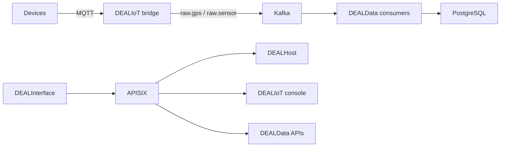

<!-- markdownlint-disable MD013 -->

# Deploy the DEAL operational architecture

The operational DEAL services are maintained together in
[Smartappli/ArchiDEAL](https://github.com/Smartappli/ArchiDEAL). The monorepo contains coordinated
snapshots of DEALIoT, DEALHost, DEALData, and DEALInterface plus the integration configuration,
tests, and deployment documentation needed to evolve them coherently.

DEALWebsite is deliberately excluded from the monorepo. It remains a static marketing PWA with no
runtime dependency on Kafka, MQTT, Django, PostgreSQL, or APISIX.

## Validated architecture



Only APISIX publishes an HTTP port to the host. It exposes these same-origin prefixes and removes
each prefix before forwarding to the native service path:

| Public path | Internal service |
| --- | --- |
| `/dealhost/*` | `dealhost:8000` |
| `/dealiot/*` | `dealiot:8080` |
| `/dealdata/core/*` | `dealdata-core:7000` |
| `/dealdata/gps/*` | `dealdata-gps:7001` |
| `/dealdata/sensor/*` | `dealdata-sensor:7002` |
| `/*` | `dealinterface:8080` |

The root integration smoke test verifies the public routes, DEALIoT access to MQTT and Kafka,
publication of GPS and sensor messages, Kafka delivery, DEALData persistence, and idempotent GPS
replay.

## Local integration deployment

Requirements:

- Docker Engine with Docker Compose v2;
- Python 3.12 or newer;
- OpenSSL;
- sufficient memory, disk space, and build time for the Rust, Node, and Python images.

Clone and start the architecture:

```bash
git clone https://github.com/Smartappli/ArchiDEAL.git
cd ArchiDEAL
make bootstrap
make validate
make up
make smoke
```

Open `http://127.0.0.1:8080`. To use another port, change `ARCHIDEAL_HTTP_PORT` in the generated
`.env` file before running `make up`.

Useful operational commands:

```bash
make ps
make logs
make down
```

`make down` preserves named volumes. Remove volumes only after confirming that their PostgreSQL,
Kafka, MQTT, or application data is no longer required.

The detailed and authoritative instructions are in the
[ArchiDEAL deployment guide](https://github.com/Smartappli/ArchiDEAL/blob/main/docs/deployment.md).

## Repository and release policy

New changes that affect more than one operational component should be made atomically in ArchiDEAL:

- `components/DEALIoT` owns MQTT ingestion, Kafka contracts, and the management console;
- `components/DEALHost` owns module discovery and APISIX route publication;
- `components/DEALData` owns Core, GPS, and Sensor persistence and APIs;
- `components/DEALInterface` owns the same-origin operational user interface.

The exact imported source revisions and the explicit exclusion of DEALWebsite are recorded in
[`sources.lock.json`](https://github.com/Smartappli/ArchiDEAL/blob/main/sources.lock.json). The four
original repositories remain the historical reference for commits made before consolidation. The
[migration guide](https://github.com/Smartappli/ArchiDEAL/blob/main/docs/migration.md) describes the
cutover and rollback policy.

For a release, pin the ArchiDEAL commit and every container image digest. Run both root workflows,
the component test suites, and the end-to-end smoke test before creating a release tag.

## Production gates

The root Compose stack is a development and cross-component integration topology. Do not expose it
directly as production. A reviewed production deployment must add at least:

- highly available Kafka, MQTT, and PostgreSQL services;
- TLS at the edge and TLS/SASL plus least-privilege ACLs for event transport;
- OIDC Authorization Code with PKCE or a backend-for-frontend for DEALInterface;
- a secret manager and tested credential rotation;
- APISIX Admin API network restrictions, preferably with mTLS;
- immutable images, SBOM and provenance verification;
- persistent-volume backup and restore drills;
- dependency-aware health checks, metrics, logs, and traces;
- the complete DEALIoT processing, storage, schema, and observability services required by the use
  case.

Production acceptance must repeat the MQTT-to-PostgreSQL test through the production gateway and
also verify authentication, authorization, failure recovery, backups, and invalid-event handling.

## Deploy DEALWebsite independently

DEALWebsite can be published from its repository root through GitHub Pages or any HTTPS-capable
static web server:

```bash
git clone https://github.com/Smartappli/DEALWebsite.git
cd DEALWebsite
npm ci
npm run build
python -m http.server 8086 --directory .
```

Preview `http://127.0.0.1:8086`. Preserve `CNAME`, all language directories, `site.webmanifest`,
`sw.js`, `sitemap.xml`, and the PWA assets when publishing. Keep the public website independent from
the authenticated operational APIs; expose DEALInterface on a separate platform origin.

## Validation record

The ArchiDEAL consolidation was merged on 17 July 2026 in pull request
[`Smartappli/ArchiDEAL#1`](https://github.com/Smartappli/ArchiDEAL/pull/1). Before merge:

- Component CI passed for DEALIoT, DEALHost, all three DEALData layers, DEALInterface, and the root
  monorepo contracts;
- Architecture Smoke passed the full container build and communication path;
- the verified path was MQTT → DEALIoT Rust bridge → Kafka → DEALData consumers → PostgreSQL;
- APISIX routes, component health, GPS and sensor persistence, and idempotent replay passed.
