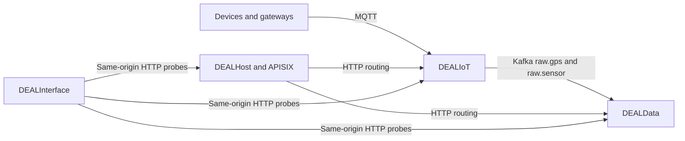

<!-- markdownlint-disable MD013 -->

# DEAL suite architecture and deployment notice

This notice covers the coordinated deployment of
[DEALIoT](https://github.com/Smartappli/DEALIoT),
[DEALHost](https://github.com/Smartappli/DEALHost),
[DEALData](https://github.com/Smartappli/DEALData), and
[DEALInterface](https://github.com/Smartappli/DEALInterface). DEALWebsite is a separate static
website and is described at the end of this document.

> **Current support status:** the repositories share compatible API and event contracts, but their
> `main` branches do not yet provide a turnkey, unified Compose or Kubernetes deployment. Deploy
> each repository independently for development. Do not expose the combined platform in production
> until the deployment gates below have been resolved and an end-to-end test has passed.

## Audited revisions

The cross-repository review was performed on 17 July 2026 against these revisions:

| Repository | Audited `main` commit | Latest release tag found |
| --- | --- | --- |
| DEALIoT | `d5a9c4468504f9b82607e7cbb05638b9bd77242f` | `v1.0.5` |
| DEALHost | `7dab33070e89d58ed0dc3c7d047ca2344d2d5a76` | `v1.0.1` |
| DEALData | `54bd14be803aa90a6354a895794841bdc1462aae` | `v1.0.2` |
| DEALInterface | `333761cd4b512b96a0dae28db7e1de5e5c51fda5` | `v1.0.0` |

Pin a tested tag or full commit SHA for every repository. Do not deploy four independently moving
`main` branches.

## Responsibilities and data flow



- **DEALIoT** owns MQTT ingestion, the Kafka event backbone, schema governance, stream processing,
  object storage, orchestration, and observability.
- **DEALData** consumes `raw.gps` and `raw.sensor`, persists the events in separate Django services,
  and exposes read and ingestion APIs.
- **DEALHost** stores module metadata and publishes gateway routes. It does not currently deploy
  containers or Kubernetes workloads itself.
- **DEALInterface** is a React control-plane UI. Its current live integrations are health probes;
  most operational metrics and actions are still static.
- **DEALWebsite** is a static marketing PWA. It has no runtime dependency on the other repositories.

## Contracts that are aligned

| Flow | Producer contract | Consumer contract | Result |
| --- | --- | --- | --- |
| DEALIoT to DEALData GPS | Kafka `raw.gps`; `device_id`, `timestamp`, latitude, longitude | DEALData GPS Kafka worker and serializer | Compatible |
| DEALIoT to DEALData sensor | Kafka `raw.sensor`; `device_id`, `timestamp`, object `payload` | DEALData sensor Kafka worker and serializer | Compatible |
| DEALInterface to DEALHost | `GET /api/gateway/health/` | Public DEALHost gateway health view | Compatible in Vite development mode |
| DEALInterface to DEALIoT | `GET /healthz` and `GET /api/health` | DEALIoT Management Console | Compatible in Vite development mode |
| DEALInterface to DEALData | `GET /health/ready/` on Core, GPS, and Sensor | DEALData readiness views | Compatible in Vite development mode |

The Kafka workers use the same persistence path as the HTTP ingestion endpoints, including
idempotency by `source + event_id` and then by payload hash. DEALIoT fields `schema_version` and
`occurred_at` are not currently retained by DEALData.

## Current deployment gates

Resolve every critical item before attempting a combined deployment.

| Severity | Gate | Operational consequence |
| --- | --- | --- |
| Critical | DEALIoT HAProxy statistics and DEALData Core both publish host port `7000` | The documented local stacks cannot run together |
| Critical | DEALData consumers are not attached to DEALIoT's private `kafka_net` | `kafka1`, `kafka2`, and `kafka3` cannot be resolved or reached |
| Critical | DEALHost and the module stacks have no shared edge network | APISIX cannot resolve DEALIoT or DEALData upstreams |
| Critical | DEALHost expects `dealdata-core`, `dealdata-gps`, and `dealdata-sensor`, while Compose defines `core`, `gps`, and `sensor` | DEALData upstream DNS names do not match |
| Critical | APISIX routes do not rewrite `/dealiot/...` or `/dealdata/...` prefixes | Upstream services receive unknown paths and return `404` |
| Critical | DEALHost configures file-driven standalone APISIX but its Django service calls the traditional per-route Admin API | Static and dynamic route management modes conflict |
| Critical | DEALInterface has only Vite development proxy rules and no production reverse-proxy package | Relative module URLs fail when the static bundle is served alone |
| Critical | DEALData enables HTTPS redirects in production while its internal healthchecks call plain HTTP | Production containers can remain unhealthy after redirecting to a port with no TLS listener |
| Critical | DEALData Kafka consumers expose no TLS, SASL, or ACL configuration | They cannot use DEALIoT's required production `SASL_SSL` contract |
| Critical | DEALIoT pins PyFlink `2.3.0` while its JVM image, connectors, plugins, Kubernetes resources, and tests target `2.2.1` | The audited deployment test fails and runtime compatibility is not assured |
| Critical | DEALHost references DEALIoT tag `v1.1.1`, which was not present in the remote tag list during the audit | The declared source version cannot be reproduced from that tag |
| Production | DEALHost module images are placeholders or mutable and marked `production_ready: false` | Manifests describe modules but are not production releases |
| Production | No cross-repository CI job starts MQTT, Kafka, DEALData, APISIX, and DEALInterface together | Repository-local green tests do not prove system integration |

Other production concerns include public DEALData read and metrics endpoints, the absence of a
production authentication flow in DEALInterface, version drift between dependency manifests and
container lock files, and an incomplete local secrets bootstrap in DEALIoT.

## Network and gateway contract to implement

Use explicit, externally named networks rather than relying on repository-specific Compose default
networks.

| Network | Members | Purpose |
| --- | --- | --- |
| `deal-kafka` | DEALIoT Kafka brokers; DEALData GPS and Sensor consumers | Private event transport only |
| `deal-edge` | APISIX; DEALHost; DEALIoT Management Console and public module APIs; DEALData Core, GPS, and Sensor | Same-origin HTTP routing |
| Repository-private database networks | Each service and its database only | Prevent direct database exposure |

On `deal-edge`, either change the DEALHost upstreams to `core`, `gps`, and `sensor`, or assign the
aliases `dealdata-core`, `dealdata-gps`, and `dealdata-sensor` to those services.

The production reverse proxy must provide these public mappings and remove the prefix before
forwarding:

| Public route | Upstream | Forwarded path example |
| --- | --- | --- |
| `/dealhost/*` | `django-app:8000` | `/dealhost/api/gateway/health/` to `/api/gateway/health/` |
| `/dealiot/*` | `management-console:8080` | `/dealiot/api/health` to `/api/health` |
| `/dealdata/core/*` | `dealdata-core:7000` | `/dealdata/core/health/ready/` to `/health/ready/` |
| `/dealdata/gps/*` | `dealdata-gps:7001` | `/dealdata/gps/health/ready/` to `/health/ready/` |
| `/dealdata/sensor/*` | `dealdata-sensor:7002` | `/dealdata/sensor/health/ready/` to `/health/ready/` |

DEALHost's additional Apicurio, Flink, Airflow, and Prometheus routes need the same prefix-removal
rule. Pick one documented APISIX deployment model:

1. traditional mode with etcd and the per-route Admin API;
2. standalone file-driven mode with atomic full-file updates and no per-route API calls; or
3. standalone API-driven mode with full configuration updates.

See the [Apache APISIX deployment mode documentation](https://apisix.apache.org/docs/apisix/deployment-modes/).

Terminate TLS at the edge and forward `X-Forwarded-Proto: https`. Healthchecks must either send the
same trusted header or use a separate internal endpoint that is exempt from HTTPS redirection.

## Validate each repository independently

These commands validate component deployments. They do **not** prove full-stack communication.
Run them in separate environments, or stop one stack before starting another until the port conflict
has been fixed.

### DEALIoT

Follow the [DEALIoT README](https://github.com/Smartappli/DEALIoT/blob/main/README.md) and create every
required environment value and Docker secret file before starting the stack.

```bash
cd DEALIoT
cp .env.example .env
mkdir -p secrets
# Populate .env and all secret files referenced by docker-compose.yml.
docker compose -f docker-compose.yml -f docker-compose.dev.yml up -d --build
bash scripts/smoke-e2e.sh
```

Do not use this as the combined-stack command while DEALIoT still publishes host port `7000`.

### DEALData

```bash
cd DEALData
cp .env.example .env
# Populate Django keys, database passwords, allowed hosts, and the ingestion token.
docker compose up -d --build
curl --fail http://localhost:7000/health/ready/
curl --fail http://localhost:7001/health/ready/
curl --fail http://localhost:7002/health/ready/
```

The documented `--profile dealiot` workers require the shared `deal-kafka` network before they can
reach a separately launched DEALIoT stack.

### DEALHost

```bash
cd DEALHost
cp .env.example .env
# Replace every placeholder and choose a consistent APISIX mode.
docker compose up -d
curl --fail http://localhost:8000/api/gateway/health/
python scripts/validate_hosting_manifests.py
```

The health endpoint above is a static DEALHost process check. It does not verify APISIX, NATS,
Valkey, GitHub, or any module upstream.

### DEALInterface

```bash
cd DEALInterface
npm ci
npm run typecheck
npm run test:unit
npm run test:integration
npm run build
npm run dev
```

Vite proxies the five module paths during development. In production, serve the built application
behind the same origin and equivalent reverse-proxy rules. Never put a durable production secret in
a `VITE_*` variable because it is embedded in browser JavaScript.

## Recommended integrated deployment sequence

After the deployment gates have been corrected:

1. **Freeze a release set.** Record one tag or full SHA per repository and pin every image by digest
   or immutable release SHA.
2. **Provision the platform.** Create `deal-kafka`, `deal-edge`, database networks, DNS, TLS
   certificates, a secret manager, and persistent volumes.
3. **Deploy DEALIoT.** Wait for Kafka quorum, create and validate the required topics and Apicurio
   artifacts, then verify MQTT-to-Kafka ingestion.
4. **Deploy DEALData.** Apply migrations for all three databases, start the HTTP services, then start
   the GPS and Sensor Kafka consumers on `deal-kafka`.
5. **Deploy DEALHost and APISIX.** Use the selected APISIX mode, shared edge network, aligned DNS
   aliases, authentication plugins, path rewrites, and aggregated upstream health checks.
6. **Deploy DEALInterface.** Build it with relative `/dealhost`, `/dealiot`, and `/dealdata/*` URLs,
   then serve it through the same TLS origin as the APIs.
7. **Run the end-to-end acceptance test.** Do not open production traffic until every check below
   succeeds.
8. **Deploy DEALWebsite independently.** It is not part of the operational request path.

## End-to-end acceptance test

At minimum, automate the following sequence in a dedicated integration repository or workflow:

1. publish a valid MQTT GPS event and a valid MQTT sensor event;
2. observe both events on Kafka `raw.gps` and `raw.sensor`;
3. confirm the DEALData consumer groups commit the records without rejection;
4. query the records through the DEALData GPS and Sensor APIs;
5. call the five DEALInterface health paths through the production gateway;
6. verify authenticated and unauthenticated behavior at the edge;
7. restart one consumer and replay an event to verify idempotency;
8. send an invalid event and verify a deliberate DLQ or rejection policy;
9. verify metrics, logs, traces, backup jobs, and restore procedures.

Expected gateway checks after path rewriting is implemented:

```bash
curl --fail https://platform.example.org/dealhost/api/gateway/health/
curl --fail https://platform.example.org/dealiot/healthz
curl --fail https://platform.example.org/dealdata/core/health/ready/
curl --fail https://platform.example.org/dealdata/gps/health/ready/
curl --fail https://platform.example.org/dealdata/sensor/health/ready/
```

## Production checklist

- [ ] All critical deployment gates in this notice are closed.
- [ ] A compatibility manifest pins repository commits, images, Kafka, Flink, Beam, and Apicurio.
- [ ] Kafka and MQTT use TLS and authenticated principals with least-privilege ACLs.
- [ ] DEALData consumers support the selected Kafka TLS/SASL settings.
- [ ] DEALData read, ingestion, and metrics endpoints have an explicit access policy.
- [ ] DEALInterface uses OIDC Authorization Code with PKCE or a backend-for-frontend; no durable token
      is embedded in the bundle.
- [ ] APISIX exposes only TLS, removes the expected path prefixes, and authenticates protected
      services.
- [ ] Secrets come from a secret manager and can be rotated without rebuilding images.
- [ ] Database and object-storage backups have passed a restore drill.
- [ ] Health checks cover dependencies rather than only process liveness.
- [ ] The complete end-to-end acceptance test runs in CI against the pinned release set.

## Deploy DEALWebsite

DEALWebsite is a static PWA and does not need Kafka, Django, APISIX, or the module networks.

```bash
cd DEALWebsite
npm ci
npm run build
python -m http.server 8086 --directory .
```

Port `8086` is used in this example because the DEALIoT development overlay publishes VerneMQ WebSocket
on host port `8080`. Preview `http://localhost:8086`, then publish the repository root through GitHub
Pages or copy the static files to an HTTPS-capable web server. Preserve `CNAME`, the language
directories, `site.webmanifest`, `sw.js`, `sitemap.xml`, and the PWA assets. `.htaccess` applies only
to compatible Apache hosting.

The website Content Security Policy currently allows `connect-src 'self'`. Keep the website
independent from operational APIs; expose the authenticated DEALInterface under a separate platform
origin rather than turning the public marketing site into a control plane.

## Validation record

The audit produced these results at the revisions listed above:

- DEALInterface typecheck, 16 unit tests, 6 integration tests, and production build: passed.
- DEALHost test suite: 97 tests passed; manifest validation passed with non-production image warnings.
- DEALIoT selected contract, integration, deployment, and smoke tests: 50 passed and 1 failed because
  PyFlink `2.3.0` no longer matches the expected Flink `2.2.1` runtime.
- DEALData contracts were reviewed statically. Its runtime tests could not be rerun in the audit
  environment because Python 3.14 and Docker were unavailable.
- No live multi-container test was claimed: Docker and Kubernetes clients were unavailable, and no
  cross-repository integration composition exists.
